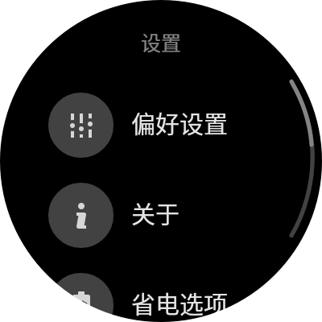
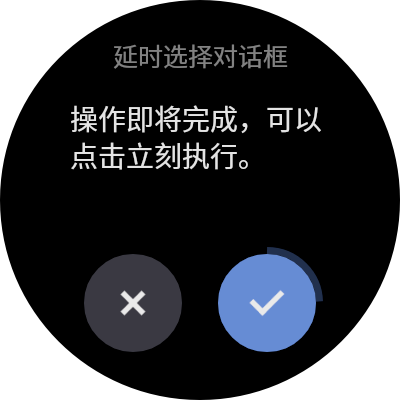

# TicDesign

[](https://jcenter.bintray.com/com/ticwear/ticdesign/1.1.0/)

[中文](README.zh.md)

Using TicDesign, you can make your wear App full of elegant user interaction, following the Ticwear [Design Guide][ticwear-design]. If your App runs on Ticwatch, Tickle support is also built in to interact with your App.




Check out [TicDesign website][ticdesign-site] to see how we think of UX on watch, and how to use the TicDesign.

# How to Use

Add dependencies in your module `build.gradle`:

``` gradle
dependencies {
    compile 'com.ticwear:ticdesign:1.1.0'
}
```

For details of development, check out [TicDesign Dev Doc][ticdesign-develop] or find it in code。

# Has Question or Found Bug?

Feel free to post [issues][ticdesign-issues] when you have questions or found a bug.

# Contribution

[Pull Request][ticdesign-pr] is welcome if you are interested in sharing your code to contribute to the open source community.

## Contribute Code

Please send pull request to `dev` branch. we will merge your code after review. When we finished testing, a new version of library will be released from `dev` to `master`, and deployed to repository center.

If you have new widgets you want to add to TicDesign, please:

1. Add your widget code to `ticwear.design.widget` package.
2. Add your resources related to the widget in files like `*_widget.xml`.
3. Add doc for your new widget. (Read following section on how to do this)

## Contribute Doc

Documentation for TicDesign, is published by [Website][ticdesign-site], hosted on [GitHub Pages][gh-pages], and written in Markdown. But currentlly we only have a Chinese version of the site. We will add support of other languages later. Or if you are familiar with Chinese, you are very welcome to translate it into other languages.

To modify or add doc, you need to check out `gh-pages` branch, and read the [README.en.md][gh-pages-readme] for details.

# License

``` txt
Copyright (c) 2016 Mobvoi Inc.

Licensed under the Apache License, Version 2.0 (the "License");
you may not use this file except in compliance with the License.
You may obtain a copy of the License at

    http://www.apache.org/licenses/LICENSE-2.0

Unless required by applicable law or agreed to in writing, software
distributed under the License is distributed on an "AS IS" BASIS,
WITHOUT WARRANTIES OR CONDITIONS OF ANY KIND, either express or implied.
See the License for the specific language governing permissions and
limitations under the License.
```

[ticwear-design]: http://ticdesign.chumenwenwen.com/design/
[ticdesign-site]: http://ticdesign.chumenwenwen.com/
[ticdesign-develop]: http://ticdesign.chumenwenwen.com/doc/
[ticdesign-issues]: https://github.com/mobvoi/TicDesign/issues
[ticdesign-pr]: https://github.com/mobvoi/TicDesign/pulls
[gh-pages]: https://pages.github.com/
[gh-pages-readme]: https://github.com/mobvoi/ticdesign/blob/gh-pages/README.en.md

