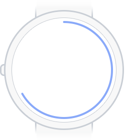
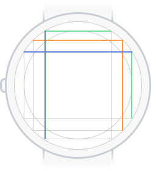
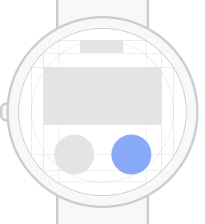
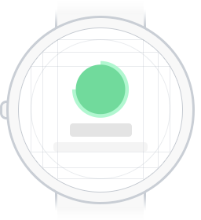
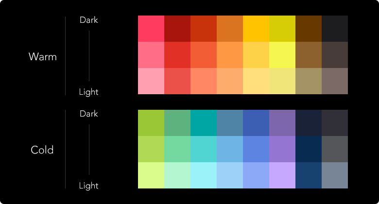
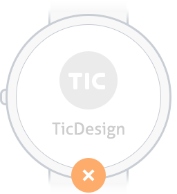
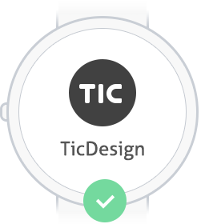

> 这篇文档是我们对设计经验的整理和总结，希望这些经验能给圆形屏幕智能手表界面设计和开发带来帮助。我们决定将文档开源，所以我们不想称之为“规范”。我们会在介绍这些经验的过程中列举一些ticwear系统中的”设计规范“，这些设计规范是用来保证ticwear系统的设计质量的，请正在阅读这篇文档的开发者不要被他们约束。我们会从一些核心理念开始讲起。

## 理念

> 一些显而易见的道理，在实践中却很有挑战；
> 一些我们认为对的事情，做的还不够好。

- **要简单**。手表的屏幕很小，不应该被用来处理过于复杂的任务，少让用户做选择题，即使有，也要少一些选项。

- **一瞥即知**。用户的视线不应该长期停留在手表上，如果有足够的时间在手表上，应该也有足够的时间去看更大的屏幕。因此手表界面上的文字要尽可能易读、易于理解。不推荐使用大段的文字。

- **身临其境设计体验**。设计应用时，应该明确用户将在什么场景下使用这款应用。安静的场所不应该有声音；运动的时候应该尽量单手操作；坐下来喝咖啡的时候，手表上也可以做些阅读吧。

- **根据手表的定位设计体验**。虽然很难用一句话说明智能手表的定位，但我们知道它屏幕小，抬手即见，不适合双手操作，可能会时刻戴着它。

  - **请坚持解放双手**。虽然设计单手操作很有挑战，但请坚持。如果连一个手表都能捆绑你的双手，你还愿意戴它吗？

  - **尽可能保证手表脱离手机独立运行**。如果经常需要手机手表之间来回切换，你还愿意戴它吗？

  - **手表不是小手机**。如果能在其他大屏终端上得到更佳的体验，而且更方便快捷，就要认真思考一个应用在手表上的必要性，不要不假思索复制一个手机app到手表。

  - **手表不只是用来看时间的**。手表是非常重要的饰品。智能手表也是手表，时尚是它的自然属性。手表就要有手表的样子。

## 样式

### 布局

- **形制**

  在界面设计过程中，我们建议将UI元素与屏幕形状有更好的结合，使得界面和硬件本身有更好的结合，同时更好利用有限的手表空间。

  

  

  
  
环形进度条

  

  

  
  
页面的圆形边界

  

  

  
  
页面尽头反馈效果

  

  

- **留白**

  适当的边距，避免拘谨，避免碰撞。

  

  

  
  
内切黄金矩形参考线

  

  

  
  
布局示例1

  

  

  
  
布局示例2

  

  

### 颜色

> 我们不严格规定颜色如何使用，因为这样会给设计带来很大的局限性。但我们还是给出一些使用建议。

- **TiColor**

  我们认为智能手表应该富有科技感和时尚感。我们从未来、宇宙、科幻电影、尖端科技、游戏这些关键词中找到了灵感，提炼了一套颜色。开发者可以在代码库中直接选用这些颜色。
  

  

  
  

  

- **黑色主背景**

  手表的屏幕很小，白色的背景会显得屏幕格外的亮，非常刺眼，在运动中使用也不容易聚焦，所以我们推荐大部分界面采用黑色（或者深色）背景。黑色在新的LED的屏幕上会更节能，可以提升智能手表的续航能力，同时也更容易和硬件本身浑然一体。

  > TiColor在纯黑色的背景上效果更好。

- **应用的颜色**

  手表界面的内容通常很少，完成一个任务可能需要多个界面，所以同一个应用的不同页面间的关联性显得更加重要。为了保证这一点，可以尝试在应用内保持一致的色调。

- **对比度**

  背景和内容不要使用色相和明度相近的颜色，在手表上对比度要更大一些，这样能保证在运动中清楚的读取信息。

  

  

  
  

  

  
  

  

### 文字排版

- **行距**

  

  

  行距和字号的关系经验值：行距为字号的0.4倍。这只是个参考，理论上讲，不过密，不过疏都是合适的。
  

  
  

- **字号**

  字号的选择对操作系统的设计至关重要，下面提供我们在设计和开发中采用的适合小屏幕字号，开发者可以在代码库中直接调用。

  

  

  
  

  

- **英文文本**

  

  

  有很大的概率会发生这样的情况：英文文本在水平方向占据的空间比表达相同意思的中文文本长。我们的经验是英文的字号要比中文至少小4px。

  
  

## 交互

- **安全的响应区域**

  尽量加大点击区域

  

  

  
  

  

  
  

  

  按钮和按钮之间，请保持一定的距离

  

  

  
  

  

  
  

  

 <!-- 手表屏幕寸土寸金，巧妙运用空间 -->

- **自然的操作反馈**。点按效果一定要明显并且自然，符合操作时的人体手势、运动方向：向下按的时候，按钮要有纵深方向的上的变化；拖拽的时候，物体的运动要符合力学定律。

- **尽量少使用toast**。尽量用图形元素去表达操作反馈。如果实在需要，也请保持简单的语言表达。

### 动画

智能手表的屏幕有限，我们建议开发者在页面元素出现、页面跳转、行为状态的过程中寄予一定的过渡动画，能够更好的帮助用户理解页面层级和手表的运行状态。动画应该尽量的自然，符合UI元素之间的关系。

> 关于动效，我们没有想好要以怎样的态度起介绍她。在手表中，能让人注意到的设计优雅的动效实在是少之又少，同时动效也是智能手表功耗的杀手之一。请永远记得动效是设计的上层建筑，但却是最温情的展现。

 
---

祝好，愿有温度。

