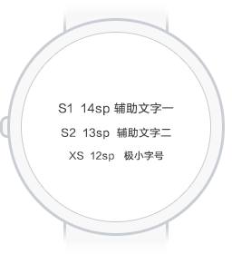

这篇文档适用于圆形屏幕的智能手表界面设计，这是一个比较新的细分领域。一般来讲，越是细分的领域，可供查阅的文档就越少，所以我们决定将文档开源，希望能给已经加入的小伙伴更多信心，给即将加入的小伙伴减少阻碍。

在一个细分领域做创新很不容易，所以我们不想称这篇文档为“规范”或者“指导”。但我们可能会在介绍这些经验的过程中引用一些Ticwear系统中的设计规范，我们用这些设计规范保证Ticwear系统的设计质量。请开发者和设计师不要被这些规范束缚。

>*在设计Ticwear系统界面的过程中，我们渐渐积累了一些经验，小伙伴们一起把这些经验归纳整理，形成了这篇文档。感谢所有为这篇文档做出贡献的小伙伴们。*

## 理念
下面是我们总结的智能手表体验设计的一些基本理念。其中有一些显而易见的道理，在实践中却很有挑战；其中有一些我们认为必须遵守的原则，还没有在产品中得到完美的体现。

#### 一瞥即知
你会经常看见佩戴传统手表的用户时不时的抬一抬手腕，瞥一眼时间，因为这个体验实在是太方便了，方便到可以形成一个“恶习”。智能手表能“瞥”见的东西就不只是时间了，这一”瞥“是智能手表最核心的体验之一。易读、易懂的文字，简单直接的界面是设计这”一瞥“的关键。
<!-- 此处最好有一个用户在合适的时候瞥一眼的动图 -->

#### 要简单
智能手表通常都有一块精小的屏幕，处理过于复杂的任务难免显得很笨拙。所以应该少让用户做选择题，尽可能的减少任务的复杂度。想象你佩戴着一块酷炫的智能手表，完成一个任务时需要你抬起手腕，靠近眼睛，用另一只手小心翼翼的点好几下，旁边的美女已经走远了！
<!-- 此处最好有一个符合以上描述的动图 -->
  
  <!--用户的视线不应该长期停留在手表上，如果有足够的时间在手表上，应该也有足够的时间去看更大的屏幕。因此手表界面上的文字要尽可能易读、易于理解。不推荐使用大段的文字。-->

#### 戴上手表，身临其境
安静的场所不应该有声音；运动的时候不应该被打断；坐下来喝咖啡的时候，手表也可以用来阅读文章...设计智能手表应用时，应该明确用户将在什么场景下抬起手腕，他/她是不是方便用另一只手。
<!-- 此处最好有一个符合以上描述的动图 -->

#### 提高独立性
智能手表诞生在”智能手机“时代，最早一批智能手表，需要和手机配对才能使用，这在一定程度上限制了智能手表的使用场景。忘带手机或者出门跑步的时候，智能手表如果可以脱离手机独立运行，一定是不错的体验。
<!-- 此处最好有一个符合以上描述的动图，如果这个用了跑步，其他就不要用了 -->

#### 请坚持解放双手
虽然设计单手操作很有挑战，可能需要硬件上提供更多支持，但请坚持。如果连一个手表都能捆绑你的双手，你还愿意戴它吗？
  
  <!-- **手表不是小手机**。如果能在其他大屏终端上得到更佳的体验，而且更方便快捷，就要认真思考一个应用在手表上的必要性，不要不假思索复制一个手机app到手表。-->

#### 要时尚
传统手表早已经超越了他原本的属性，成为非常重要的饰品。智能手表也同样具备时尚属性。时尚的外观，精美的表盘，优雅的软件界面都是智能手表重要的时尚元素。

## 样式

### 布局
设计圆形屏幕的界面布局，是一件很有趣的事情。圆形的屏幕边缘会让你不由自主的尝试一些独特的布局方式，也会发现很多传统布局方式需要针对圆形屏幕做细微的调整。

#### 界面与屏幕形状的结合

我们建议设计师尽可能将UI元素与屏幕形状相关联，这样能更好的利用屏幕空间，可以使得软件界面和硬件结合的更自然。这一点很有挑战，但也是圆形屏幕智能手表的界面设计最有魅力的地方。

环形进度条

页面的圆形边界

页面尽头反馈效果

<!-- 可以补充两个图：1、listview的挠挠状态，2、弧形排列的导航点 -->

#### 边距和参考线
也许有些界面并不能有很好的结合圆形的设计方案，但他依然可以很易懂、很美观。这就需要给界面留适当的边距，避免界面整体的局促，避免元素间的碰撞。内切正方形、内切黄金矩形、同心的圆形所形成的边距空间能给设计带来很大帮助。当然，你也可以根据实际设计需要选择更合适的布局。

参考线

布局示例1

布局示例2

<!-- #### **平衡**
一块精小的圆形屏幕，可能比大的版面更需要做到平衡。一些细微的不平衡都会格外明显。
#### 需要在布局里扩展一到两个点
-->

### 颜色
关于颜色，我们不想规定颜色的使用，因为这样会给设计带来很大的局限性。我们会给出一些建议和我们在Ticwear系统中使用的颜色作为参考。

>*如果展开来说颜色的选择和搭配，可能会远远超出这篇文档的范围，开发者和设计师们可以参阅网络上的其他文档来获取更多关于颜色的知识。*

#### **建议采用黑色主背景**
手表的屏幕很小，白色的背景会显得屏幕格外的亮，非常刺眼，在运动中使用也不容易聚焦。所以我们推荐大部分界面采用黑色（或者深色）背景。黑色在一些新技术的屏幕上会更节能，也可以提升智能手表的续航能力，同时也更容易和硬件本身浑然一体。

#### **TiColor**
我们认为智能手表应该富有科技感和时尚感。我们从未来、宇宙、科幻电影、尖端科技、游戏这些关键词中找到了灵感，提炼了一套颜色。这些颜色在纯黑色的背景上效果更好。

#### **应用程序的颜色**
手表界面的内容通常很少，完成一个任务可能需要多个界面，所以同一个应用的不同页面间的关联性显得更加重要。为了保证这一点，可以尝试在应用内保持一致的色调。

<!--需要一个例子 -->

#### **合适的对比度**
背景和内容不要使用色相和明度相近的颜色，在手表上对比度要更大一些，这样能保证在运动中清楚的读取信息。

### 文字排版

文字排版对一个应用程序的设计至关重要。选择合适的字号、合适的行距，不但会让用户在阅读时获得更好的体验，也会让应用程序获得更好视觉效果。在手表上，合适的文字大小才能保证“一瞥即知”，才能保证在某些特定场景的阅读体验。大部分情况下，建议开发者和设计师尊守操作系统的文字排版规范，因为操作系统的开发者更熟悉系统所适配的硬件的特性。

#### **字号**
下面是Ticwear系统中的字号规范。如果你也在设计一块1.4寸屏幕的智能手表界面，这套字号规范将更具参考价值。<a href="../doc/#style-and-theme">开发者可以在开发文档中查看如何使用。</a>

  
#### **行间距**

行距和字号的关系经验值：行距为字号的0.4倍。这只是个参考，理论上讲，不过密，不过疏都是合适的。

#### **英文文本**

如果应用程序需要有英文的版本，会有很大的概率发生类似这样的情况：英文文本在水平方向占据的空间比表达相同意思的中文文本长，导致原本的布局平衡被打乱。可以尝试下面两种解决方案：

1.  让英文字号比汉字字号至少小2px。
2.  采用一些“压缩版”的字体：如 Google 的 Roboto Condensed。

<!-- ### Writing ##样式 下面可以补充一个讲语言表述的点，也可以没有，workflowy上保留了草稿 -->

## 交互

#### 尽量加大响应区域
建议为UI元素设计安全舒适的视觉和响应区域。考虑到智能手表的使用场景和产品定位，这是一个显而易见的原则。

#### 请保持一定的距离
为了最大限度减少误操作的可能性，任何两个可点击的UI元素之间都应该保持足够并且合适的距离。

 <!-- #### 手表屏幕寸土寸金，巧妙运用空间，需要一个btn缩小的动画，workflwoy里还写了一个pickview，不知道跟寸土寸金啥关系-->

#### 自然的操作反馈
点按效果一定要明显并且自然，符合操作时的人体手势、运动方向：向下按的时候，按钮要有纵深方向的上的变化；拖拽的时候，物体的运动要符合力学定律。

<!--需要一个例子 -->

#### 尽量少使用toast
尽量用图形元素去表达操作反馈。如果实在需要，也请保持简单的语言表达。

<!--需要一个例子 -->

## 动效

智能手表的屏幕有限，我们建议开发者在页面元素出现、页面跳转、行为状态的过程中寄予一定的过渡动画，能够更好的帮助用户理解页面层级和手表的运行状态。动画应该尽量的自然，符合UI元素之间的关系。

<!--需要：开关动效；神奇移动是啥不知道；表盘的动效也行；listview的挠挠动效也行； 至少3个-->

关于动效，我们没有想好要以怎样的态度介绍她。在手表中，能让人注意到的设计优雅的动效实在是少之又少，同时动效也是智能手表功耗的杀手之一。请永远记得动效是设计的上层建筑，但却是最温情的展现。

###### *祝好，愿有温度。*

