This doc applies to the UI design for round-screen smartwatch, a relatively new niche market. Generally speaking, the more subsidized the niche market is, the fewer available files there are for reference. Hence we have decided to make this file open-source, hoping that this friendly gesture helps boost the confidence of our work partners and remove the barriers for those who want to join us in the near future.

Since it is quite demanding to continuously bring innovations to a niche market, we do not want to make this file as a permanent golden “rule” or “guideline” for you to follow. When we share those experiences with you, some design principles for Ticwear system are included ONLY  to ensure design quality. Yet feel free to be creative and not to get yourself restrained by those guidelines.

>*Over the process of designing Ticwear system interface, we have accumulated some valuable experiences that are carefully organized and compiled in this file. Great thanks to all work partners who have made a contribution to this file.*

## Design Concept

Here are the basic concepts we have summed up for smartwatch UI design. While some of them seem apparent, following them through practice can be fairly challenging. Some of them are principles we ought to follow, but not perfectly embodied in the product yet.

#### Know through One Glance

Traditional watch users are used to glancing their wrist to check time every now and then thanks to its extreme convenience. As for smartwatch users, the information they get from a rapid glance goes far beyond time, an user experience that matters the most. Optimizing this experience through design thus directly lies in readable, comprehensive text and simple, direct interface.

<!-- 此处最好有一个用户在合适的时候瞥一眼的动图 -->

#### Be Simple

Smartwatch usually comes with a delicate tiny screen, making it fiddly for users to handle over-complex operations. We are supposed to alleviate the decision-making stress for users by reducing the complexity of operations.

<!-- 此处最好有一个符合以上描述的动图 -->

<!--用户的视线不应该长期停留在手表上，如果有足够的时间在手表上，应该也有足够的时间去看更大的屏幕。因此手表界面上的文字要尽可能易读、易于理解。不推荐使用大段的文字。-->

#### Be Part of Your Life

The smartwatch is not supposed to make any noises at quiet places; it shall leave users alone while they exercise; it can be used for some light reading when we sit and drink coffee….When we design apps for smartwatches, we ought to make sure when users need to lift their wrist and whether it is convenient for them to use the other hand.

<!-- 此处最好有一个符合以上描述的动图 -->

#### Be More Independent

Smartwatch was born in the “smartphone” era. The earliest generation of smartwatch cannot function without a cellphone, leading to a limited usability in our daily life to a certain extent. It shall be great if smartwatches are able to function without cellphones when we leave our phone at home or out for running.

<!-- 此处最好有一个符合以上描述的动图，如果这个用了跑步，其他就不要用了 -->

#### Set Hands Free

Although designing a one-handed operation mode can be fairly challenging and might need more hardware support, insist on doing so. If wearing a watch refrains you from doing other things, why bother wearing it?

#### Smartwatch is Not a Mini Smartphone

Both smartwatches and smartphones have touch screen and are designed and developed based on similar operation system. Thus it is easy for us to inadvertently fall into habitual thinking patterns. Yet only one hand has been needed when wearing a watch since the very beginning. And watch itself was invented for the purpose of keeping track of time through a simple lift of wrist. We then firmly believe smartwatch should be like a watch, not the other way around.

If an app works better and faster on other big screens, we ought to assess whether it is necessary to apply it on smartwatch instead of copying it to the smartwatch without a second thought.

#### Be Stylish

Traditional watches nowadays have gone far beyond its old attribute, and has become a crucial fashion accessory. The same thing applies to smartwatches. Trendy design, exquisite watch faces and elegant software interface are all essential fashion components of smartwatches.

## Style

### Layout

Designing interface layout for round screen is quite fun. You just cannot help to try some distinctive ways of layout. Meanwhile you will find that many traditional layouts need minor modifications for round screen.

#### Combination of Interface and Shape of Screen

We usually recommend designers to let UI elements align with the screen shape, which helps them make a better use of the tiny screen space and enables a more natural combination of the software interface and hardware appearance. Achieving that could be fairly challenging, while we deem it as the most charming part of the interface design.

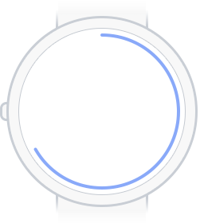

Circular Progress Bar

Circular Boundaries of Page

Edge Effect of Page

Focusable List

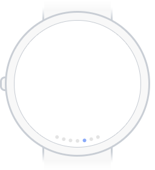

Indicators with Circular Layout

Button Layout

#### Spacing and Reference Line

Perhaps some interfaces are hard to get modified to fit the round screen well, but they are still easy to understand and aesthetically pleasant. Then what we need to do is to leave some spacing to avoid a constrained/cramped layout and the collision of UI elements. Besides, you are always welcome to select a better layout based on actual design needs.

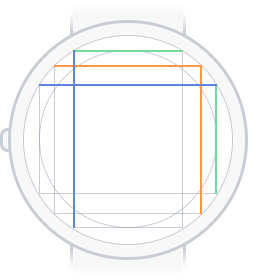

Guidelines

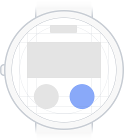

Layout Example 1

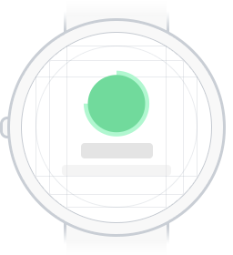

Layout Example 2

<!-- #### **平衡**
一块精小的圆形屏幕，可能比大的版面更需要做到平衡。一些细微的不平衡都会格外明显。
#### 需要在布局里扩展一到两个点
-->

### Color

Speaking of color, we do not want to provide too much guideline here to constrain your creativity on design. We do put a few suggestions and the color we use in Ticwear system here, just for your reference.

>*If we elaborate on the selection and match of colors here, we are afraid that it might go too far. Thus we recommend you to read other files online to acquire more information about color.*

#### Use Black As Background Color

Smartwatch has a tiny screen. Using white as the background makes the screen too bright, and not easy for readers to check information during exercise. Therefore we recommend you to use black (or any dark color) as background for most interfaces. Black as a color, is more energy-efficient on new-tech screens. It helps extend smartwatch’s battery life and naturally blends into hardware as well.

#### TiColor

Our ideal smartwatch ought to be geeky and trendy/chic. We have drawn inspirations from a series of keywords, such as future, universe, sci-fi movies and edgy technology and formulated a color palette for you. These colors look better on a plain black background.

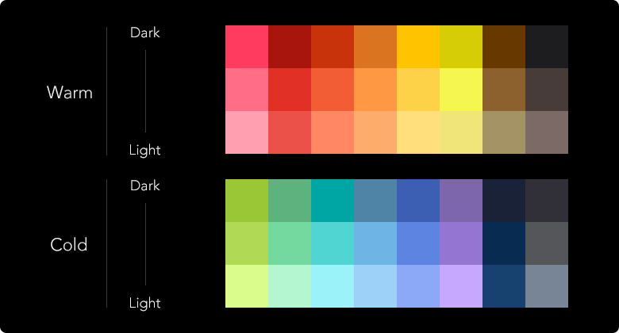

#### App Color

Smartwatch interface generally does not have too much content as completing a single task might involve multiple interfaces. The relevance of multiple interfaces for one same app therefore really matters here. To ensure that relevance, you might want to keep the colors consistent within the app.

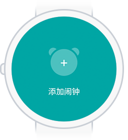

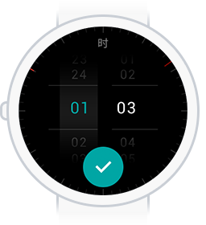

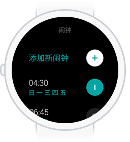

#### Appropriate Color Contrast

Do not apply colors with similar hue and brightness for the background and content at the same time. Try to improve/enhance the contrast to make sure that users can read information clearly during exercise.

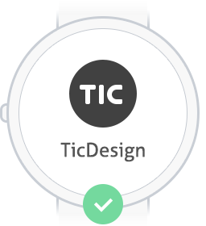

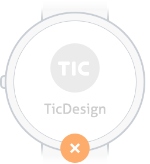

### Typography

Typography is essential to app design. Selecting appropriate font and spacing not only gives readers better reading experiences, but also ensures a nicer visual display of the app. In order to enable “know through one glance”, we have to pick an appropriate font size to bring good reading experience on smartwatch, especially under certain circumstances. Most of the time, we recommend you to follow the text layout guideline for the operation system since its developers are more familiar with the characteristics of the hardware that the system setup on.

#### Font Size

Please try not to display more than two fonts on the same interface and keep the distinction between different fonts obvious. And this rule applies to more than smartphone.

What listed below is a whole set of font guideline for Ticwear system, which you might find helpful If you are trying to design an interface on a 36mm smartwatch screen. You are also welcome to refer to the [developer doc](../doc/#style-and-theme) for more usage guideline.

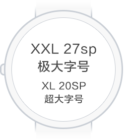

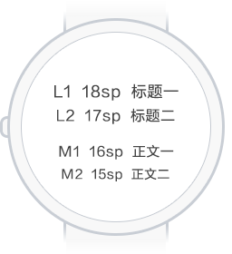

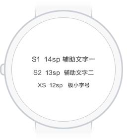

#### Row Spacing

The spacing between rows significantly affects the reading experience.  We use the following reference: row spacing should be 0.4x the font size.  
This is only a consideration.  In theory, neither too much or too little row spacing can be acceptable.

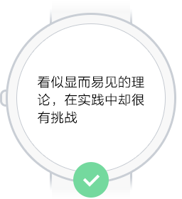

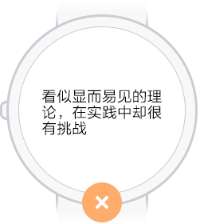

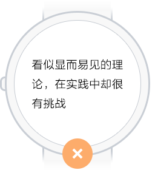

#### English Text

When you need English texts for designing an app, you are very likely to encounter the following case: Chinese text message, when translated into English, gets much longer horizontally, therefore disturbing the original balance of layout. This problem could be solved by the following two methods:

1. Making English text font at least 2px smaller than Chinese text font.
2. Use some “condensed” text font: such as Google’s Roboto Condensed

<!-- ### Writing ##样式 下面可以补充一个讲语言表述的点，也可以没有，workflowy上保留了草稿 -->

## Interactions

#### Augment responding area as much as possible

We suggest that you design pleasant visual and responding areas. This is an obvious rule, considering the user scenario and product positioning of smartwatch.

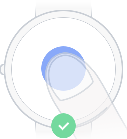

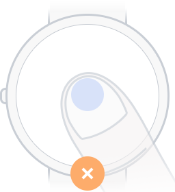

#### Ensure Enough Spacing

In order to reduce the possibility of unwanted triggering, we suggest that you ensure enough spacing between any two UI elements for touch.

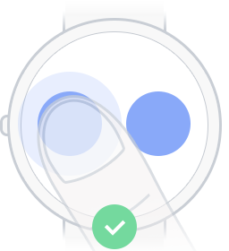

<!-- #### 手表屏幕寸土寸金，巧妙运用空间，需要一个btn缩小的动画，workflwoy里还写了一个pickview，不知道跟寸土寸金啥关系-->

#### Natural Response

The response to touch should be obvious and natural, in harmony with human gesture and motion directions. For example, when the users press downward, the button should respond with changes in the vertical direction; When the users drag the objects, the motion of the object should agree with the laws of motion.

<!--需要一个例子 -->

#### Use Toast As Less As Possible

Use graphs to give response. Keep it short and simple if a toast is really necessary.

<!--需要一个例子 -->

## Animations

Since smartwatch has a tiny screen, we recommend that developers design some transition animations when new elements appear or the page jumps, in order to better help users understand the level of pages and the state of the watch. Animation should be as natural and consistent with UI elements as possible.

<!--需要：开关动效；神奇移动是啥不知道；表盘的动效也行；listview的挠挠动效也行； 至少3个-->

In regards to animations, we don’t know how to introduce it in an appropriate way. On a smartwatch, there are few elegant animations that can draw people’s attention; at the same time, it is a battery killer to the smartwatch. Please always remember that animations is the upper level architecture in design, but it is the most tender part of the product.

祝好，愿有温度

