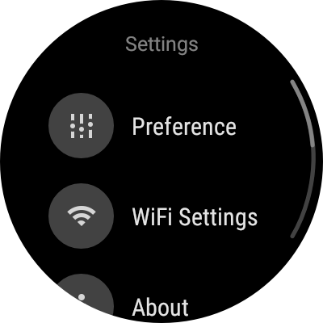

By using Ticwear Design Support Library (later referred to as the design lib), you can easily develop an app that meets Ticwear’s [design guideline][ticwear-design] and supports novel interactions like Tickle.

Except Ticwear’s own unique interactions, other parts of work can be applied to Android Wear also.

Before you start using the library,  you ought to set your Application Theme as either `Theme.Ticwear` or other derivative themes. Then you are able to use the various sorts of components in the library.

The library includes the following parts:

1. [Style and Theme](#style-and-theme): Defines some styles of text, page or widgets, and transitions of pages.
2. [Coordinator Layout](#coordinator-layout): Based on [Android Design Support][google-design-support], We create a set of page structure for wearables, Besides scroll effect in Google Design, we also add a overscroll-bounce effect for the App bar.
3. [Support Tickle](#support-tickle): We have provided developers a set of convenient methods to support Tickle, and a set of widgets that works better with Tickle. Such as [Ticklable RecycleView](#ticklable-RV), [Focusable LayoutManger](#focusable-LM), etc.
4. [Preference](#preference): Provide a preference system like [Android Settings][android-settings], that fits [Ticwear Design][ticwear-design]. Its works better on wear, and support Tickle interaction.
5. [Dialogs](#dialogs): Like Android's [AlertDialog][android-alert-dialog], We also provide a set of dialogs suitable on wear. Including [Normal AlertDialog](#alert-dialog), [Number Picker Dialog](#number-picker-dialog), [Date & Time Picker Dialog](#date-picker-dialog), [List Choice Dialog](#list-choice-dialog), etc.
6. [Floating Context Menu](#menu): Similar to [Android's FloatingContextMenu][android-FloatingContextMenu], you can create menu items via [Menu resource][android-menu-resource], then use `FloatingContextMenu` to load and display them, and get the callback of their selection.
7. [Other Widgets](#widgets): Ticwear provide a set of widgets suitable for wear, including [ScalableTextView](#scale-textview), [FloatingActionButton](#fab), [PrimaryButton](#primary-button), [NumberPicker](#number-picker), [DatetimePicker](#date-picker), and [Checkbox, RadioButton, SimpleSwitch](#two-state-button), etc.

> Any of the content in the library can be demonstrate with "demo" App from the [source code][ticdesign-source].

## <a name="style-and-theme"></a>Style and Theme {#style-and-theme}

Ticwear provide a set of Themes that meets Ticwear design guideline. Developer can use or extends those themes, including:

1. `Theme.Ticwear`: Default theme of Ticwear Design, defines a series of styles for text & page, transitions, and settings, etc.
2. `Theme.Ticwear.Dialog`: Used for dialogs on wear. Fullscreen displayed, swipe to dismiss with slide in/out transition.

Except Themes, developers can also use a set of styles in `styles_ticwear.xml`.

### <a name="list-styles"></a>List Styles {#list-styles}

To acquire better user experience, please:

1. Set a style point to `Widget.Ticwear.ListView` for your `ListView` (or `TickableRecyclerView`)
2. Set a style point to `Widget.Ticwear.ListItem` for your list item container.

These two styles, has covered display or list view on wear. Including top/bottom margin of page, horizontal padding of list items, and click effect of list items.


### <a name="text-styles"></a>Text Styles {#text-styles}

Ticwear defines a series of text styles that all compatible with the [Material Design Typography](https://www.google.com/design/spec/style/typography.html#typography-styles), including text size, line spacing, font, etc. ("Display" style is too large for smartwatches, so it not brings to TicDesign)

Ticwear Design has defined the styles listing below：

``` xml
TextAppearance.Ticwear
TextAppearance.Ticwear.Headline
TextAppearance.Ticwear.Title
TextAppearance.Ticwear.Title.Inverse
TextAppearance.Ticwear.Body2
TextAppearance.Ticwear.Body1
TextAppearance.Ticwear.Hint1
TextAppearance.Ticwear.Hint2
TextAppearance.Ticwear.Button
TextAppearance.Ticwear.Inverse

TextAppearance.Ticwear.Large
TextAppearance.Ticwear.Large.Inverse
TextAppearance.Ticwear.Medium
TextAppearance.Ticwear.Medium.Inverse
TextAppearance.Ticwear.Small
TextAppearance.Ticwear.Small.Inverse
TextAppearance.Ticwear.Widget
TextAppearance.Ticwear.Widget.Button
```

And, some basic font size:

``` xml
<dimen name="tic_text_size_extra_extra_large">27sp</dimen>
<dimen name="tic_text_size_extra_large">20sp</dimen>
<dimen name="tic_text_size_large_1">18sp</dimen>
<dimen name="tic_text_size_large_2">17sp</dimen>
<dimen name="tic_text_size_medium_1">16sp</dimen>
<dimen name="tic_text_size_medium_2">15sp</dimen>
<dimen name="tic_text_size_small_1">14sp</dimen>
<dimen name="tic_text_size_small_2">13sp</dimen>
<dimen name="tic_text_size_extra_small">12sp</dimen>
```

Developers are free to use and combine the styles and sizes listed above.

### <a name="color-styles"></a>TiColor palette {#color-styles}

We have provided a set of Ticwear-style palette resource for developers, allowing them to directly use a specific color through resource. The naming of basic colors conforms to the following format:

``` java
R.color.tic_basic_<name>{_<decorate>}
```

In this format, `name` means color’s name. All available color names are defined in `ColorPalette.ColorName`, corresponding with a specific color. And `decorate` implies a modification of color with three options to choose from: `darken`, `lighten` and `normal`. When `decorate` is not assigned, the default setting is `normal`.

In addition to directly using the resource files, developers are also able to acquire Ticwear colors via class `ColorPalette` programmatically:

1. Call `ColorPalette.from(Context)` to obtain a palette instance.
2. Use `ColorPalette.color(ColorName)` to acquire color object that corresponds with `ColorName`.
3. If decorate is needed, call `ColorPalette.Color.lighten()` or `ColorPalette.Color.darken()` to acquire the modified color object.

  > If the color can not apply assigned modification, original instance of color will be returned. For example, 'Indigo'.darken().darken() equals to 'Indigo Darken'.

4. Finally, get value of color through `ColorPalette.Color.value()`.

For example, if we need to acquire `Indigo Darken` as a modified color value, we ought to call the following codes:

``` java
int color = ColorPalette.from(context)
                .color(ColorPalette.ColorName.INDIGO)
                .darken()
                .value();
```

## <a name="coordinator-layout"></a>Coordinator Layout {#coordinator-layout}

Similar to [Android Design Support][google-design-support], Use `CoordinatorLayout` to structure `AppBarLayout` and other page content can let the App bar response to the scrolling of content, therefore achieving multiple effects.

### Enable Circular Scroll Bar and Edge Effect

<div class="row">
<div class="col s12 m7" markdown="1">

Use `CoordinatorLayout` to wrap scrollable content, developers are able to acquire a circular scroll bar, a edge effect with illuminant, and a overscroll-bounce effect.

To enable this, assign a `app:tic_layout_behavior` with `"@string/tic_appbar_scrolling_view_behavior"` for the scrollable content, to let `CoordinatorLayout` to operate your View.

</div>
<div class="col s12 m4 push-m1 center">

</div>
</div>

For example:

``` xml
<ticwear.design.widget.CoordinatorLayout
    xmlns:android="http://schemas.android.com/apk/res/android"
    xmlns:app="http://schemas.android.com/apk/res-auto"
    android:layout_width="match_parent"
    android:layout_height="match_parent"
    >

    <ScrollView
        android:layout_width="match_parent"
        android:layout_height="match_parent"
        android:nestedScrollingEnabled="true"
        android:paddingStart="?android:listPreferredItemPaddingStart"
        android:paddingEnd="?android:listPreferredItemPaddingEnd"
        android:paddingTop="@dimen/tic_list_padding_bottom_ticwear"
        android:paddingBottom="@dimen/tic_list_padding_bottom_ticwear"
        app:tic_layout_behavior="@string/tic_appbar_scrolling_view_behavior"
        style="@style/Widget.Ticwear.ListView"
        >

        <TextView
            android:id="@+id/text_content"
            android:layout_width="match_parent"
            android:layout_height="wrap_content"
            android:textAppearance="?android:textAppearanceSmall"
            android:text="@string/text.long_content"
            />

    </ScrollView>

</ticwear.design.widget.CoordinatorLayout>
```

### <a name="title-bar"></a>AppBar response to scroll {#title-bar}

In addition to effect such as "fixed, scrolling, quick enter, collapsed" supported by Android's `AppBarLayout`, TicDesign also supports "overscroll-bount" effect, along with a `ScalableTextView`, to ensure that the Appbar can be strethed up with a resistance.

Here is an example for page layout:

``` xml
<?xml version="1.0" encoding="utf-8"?>
<ticwear.design.widget.CoordinatorLayout
    xmlns:android="http://schemas.android.com/apk/res/android"
    xmlns:app="http://schemas.android.com/apk/res-auto"
    android:layout_width="match_parent"
    android:layout_height="match_parent"
    android:scrollbars="vertical"
    app:tic_overScrollEffect="bounce">

    <include layout="@layout/content_main" />

    <ticwear.design.widget.AppBarLayout
        android:layout_width="match_parent"
        android:layout_height="wrap_content">

        <ticwear.design.widget.ScalableTextView
            style="?android:textAppearanceSmall"
            android:layout_width="match_parent"
            android:layout_height="32dp"
            android:gravity="center"
            android:text="@string/main.title"
            app:tic_layout_scrollFlags="scroll|overScrollBounce|enterAlways"
            app:tic_layout_scrollResistanceFactor="0.5"
            app:tic_scaleFactor="0.5"
            />

    </ticwear.design.widget.AppBarLayout>

</ticwear.design.widget.CoordinatorLayout>
```

Through a variety of effects, this layout to achieve the fast into the title (page scrolling to the bottom after the drop-down, the title appears immediately, without rolling to the top), and stretch rebound effect (after page scrolling to the top, continue the drop-down, title with rolling operation is widening, let go after snap back).

`Tic_layout_XXX`, similar to `android:layout_XXX`, reveals the layout behavior of View in parent, which is irrelevant to the content. The attributes that do not start with `tic_layout_` are the actual attributes of View. Here is an elaborate explanation of those attributes:  

* `app:tic_overScrollEffect` assigns the effect when the page content is scrolled to the end. When `CoordinatorLayout’s` subelement fails to consume the nested scroll event, it will trigger the effect defined here. Currently, it merely supports `none` and `bounce` effect.
* `app:tic_layout_scrollFlags` assigns the corresponding action as the headline scrolls, with a combination of various actions based on needs.
* `app:tic_layout_scrollResistanceFactor` assigns the fold change of overall height when the tagline stretches. When the fold change is 1, corresponding header height change and rolling distance with no damping effect. As the fold change gets closer to 0, the damping effect becomes greater along with smaller changes in height.
* `app:tic_scaleFactor` assigns the text scaleFactor. When scaleFactor is 1, the text will be aligned with the size of textView through geometric scaling. The scaling effect gets less and less obvious as the scaleFactor gradually reaches zero. Details you can refer to [scale-textview](#scale-textview). 

## <a name="support-tickle"></a>Support for Tickle {#support-tickle}

By enabling `SidePanelEventTarget` or `SidePanelGestureTarget`, developers can easily add support for Tickle for their self-defined view.

`SidePanelEventTarget` interface contains a function for basic events. Similar to the touch event, Tickle also includes the following processing steps:

1. `DispatchTouchSidePanelEvent`: In the dispatch step, decide whether to use the current view to process Tickle event, or dispatch it.
2. `onTouchSidePanel`: Decide if the current view will process Tickle
3. `SidePanelGestureTarget`: Contains common Tickle gestures, such as single click, double click，long click, scroll, and so on. If these is no `SidePanelEventTarget` to process Tickle event，the tickle event will be viewed as Tickle gesture and be dispatched for the `SidePanelGestureTarget` for further processing.

Details you can refer to [Tickle API](http://developer.ticwear.com/doc/tickle-api)。

### <a name="ticklable-RV"></a> RecyclerView for supporting Tickle interaction {#ticklable-RV}

`TickableRecyclerView` expands `RecyclerView` to support the interaction ways in Tickle. You can assign a normal [`LayoutManager`][android-LM] for it. Then, the gesture of touch is no difference as the `RecyclerView` expect that it forwards the Tickle event. The tickle gesture equals to touching the right side of View. `TickableRecyclerView` can support Tickle when it combines with common `LayoutManager`.

Through `TicklableLayoutManager`, you can achieve the customized [`LayoutManager`][android-LM] for Tickle. For more information, you can see how `FocusableLinearLayoutManager` is realized.

We have a special design for `TickableRecyclerView` so that it can work smoothly with `AppBarLayout`, and when it focuses, it can better realize various effects of TitleBar. You can read more about it in the `TickableRecyclerViewBehavior` code in the source code. 

To make it easier for developers, we have developed a series of Adapter to cater to specific needs quickly:

1. `SimpleRecyclerAdapter` is applicable for simple items with icon or text only. It automatically binds data and views by mapping relationship. The method to use it is similar to that of [`ListView.SimpleAdapter`][simple-adapter].
2. `CursorRecyclerViewAdapter` provides the visits to database, such as `android.widget.CursorAdapter`.
3. `TrackSelectionAdapterWrapper` uses its ability to package other `Adapters` to get the selection ability in `ListView`. You can refer to its use in `AlertController` for more details.

### <a name="focusable-LM"></a>LayoutManager with focusing effects {#focusable-LM}

`FocusableLinearLayoutManager` integrated the advantages of `LinearLayoutManager` and `WearableListView`, making the list controller perform as common LinearLayout RecyclerView in its normal state, in order to display diverse and elegant visual effects. In addition, the users can randomly click the listed item in the interface. After the user tickles the item, it enters into the focus state; its content will becomes larger and focuses on the item while entering the interface, making the operation more accurate and targeted.

<div class="row">
<div class="col-half">

</div>
<div class="col-half">

</div>
</div>

When using `FocusableLinearLayoutManager`,  you need to have your ViewHolder inherit `FocusableLinearLayoutManager.ViewHolder`, to define the transition animations between the focusing state, non-focusing state and normal state.

`FocusableLinearLayoutManager.ViewHolder` has set the default focusing state animation, which is enlarging and brightening when in the focusing state and narrowing and darkening in the normal state. 

If you want to define a more delicate animation effect, you can realize `FocusableLinearLayoutManager.OnFocusStateChangedListener` interface with your `ItemView`. Or you can reload the method of `ViewHolder.onFocusStateChanged`.

If you wish that your animation is also consistent with the gesture, but not only just the switch between the focusing and non-focusing state, you will need to use your `ItemView` to further realize `FocusableLinearLayoutManager.OnCentralProgressUpdatedListener`; or, you can override `ViewHolder.onCentralProgressUpdated`.

`FocusableLinearLayoutManager` will first update the state via `onFocusStateChanged`, and then get more delicate effects via `onCentralProgressUpdated` when the user Tickles. When the state is transited back to the normal state from the focused state, use `onFocusStateChanged`。

Thus, a better plan is to realize transition animations via `View.animate()` when the state is transited back to the normal state, and to update the size and style of View via progress in the Focusing state.  

Below is a simple reloading example (same as the default animations)

``` java
@Override
protected void onCentralProgressUpdated(float progress, long animateDuration) {
    float scaleMin = 1.0f;
    float scaleMax = 1.1f;
    float alphaMin = 0.6f;
    float alphaMax = 1.0f;

    float scale = scaleMin + (scaleMax - scaleMin) * progress;
    float alphaProgress = getFocusInterpolator().getInterpolation(progress);
    float alpha = alphaMin + (alphaMax - alphaMin) * alphaProgress;
    transform(scale, alpha, animateDuration);
}

@Override
protected void onFocusStateChanged(@FocusState int focusState, boolean animate) {
    if (focusState == FocusableLinearLayoutManager.FOCUS_STATE_NORMAL) {
        transform(1, 1, animate ? getDefaultAnimDuration() : 0);
    }
}

private void transform(float scale, float alpha, long duration) {
    itemView.animate().cancel();
    if (duration > 0) {
        itemView.animate()
                .setDuration(duration)
                .alpha(alpha)
                .scaleX(scale)
                .scaleY(scale)
                .start();
    } else {
        itemView.setScaleX(scale);
        itemView.setScaleY(scale);
        itemView.setAlpha(alpha);
    }
}
```

## <a name="preference"></a>Setting System {#preference}

Ticwear‘s settings system is similar to [Android Settings][android-settings]. You can use Ticwear Preference in a similar way you would use Android Preference. But it should be noted that Ticwear Preference’s built-in `Listview` has been changed to `TicklableRecyclerView`. You need to use `RecyclerView.Viewholder` in order to bind statistics with Preference View.  

You have to inherit `Preference.VewHolder` when you need to achieve the customized `Preference`. We also need to cover its method as to bind your customized statistics.

## <a name="dialogs"></a>Dialog Box {#dialogs}

<div class="row">
<div class="col s12 m7" markdown="1">

Being fully aware of the convenience of Dialog, we made a few modifications to make it look neater on smartwatch. We also extended the push button and list display of dialog ,and provide numerical selection dialog. All the changes listed above have helped provide handy user experience while remained the convenience of Android interface.

</div>
<div class="col s12 m4 push-m1 center">

</div>
</div>

### <a name="alert-dialog"></a>Alert Dialog {#alert-dialog}

We transplanted and extended Android’s [`AlertDialog`][android-alert-dialog] with a customized theme for smartwatch. A circular button that suits smartwatch better is provided as well to replace the original text button.

When the set-up (设置的) text message gets really long, it can scroll up and down and the bottom of the icon button will disappear as it scrolls to ensure better reading experience.

The way to use it is no different from using the original `AlertDialog`. The only thing needed is to formulate either an icon document or the icon’s `Drawable`, similar to the method as shown below: 

``` java
new AlertDialog.Builder(context)
        .setTitle(R.string.dialog_title)
        .setMessage(R.string.dialog_content)
        .setPositiveButtonIcon(R.drawable.ic_btn_ok, new OnClickListener() {
            @Override
            public void onClick(DialogInterface dialog, int which) {
                // Do something for positive action.
                dialog.dismiss();
            }
        })
        .show();
```

While we use the dialog, we can achieve the effects we want by assigning `android:alertDialogTheme` from a customized dialog style. 

`AlertDialog` has the following styles that can be included in themes:

1. `tic_windowIconStyle`：assigning the style of alert dialog’s headline icon
2. `android:windowTitleStyle`：assigning the style of dialog’s title
3. `tic_iconButtonBarStyle`：assigning the style of icon button bar
4. `tic_iconButtonBarPositiveButtonStyle`：assigning the button style of positve
5. `tic_iconButtonBarNegativeButtonStyle`：assigning the button style of negative
6. `tic_iconButtonBarNeutralButtonStyle`：assigning the button style of neutral. Since smartwatches have tiny screens,  we don’t recommend this option.


### <a name="list-choice-dialog"></a>List Selection Dialog Box {#list-choice-dialog}
 

Similar to Android’s [`AlertDialog`][android-alert-dialog], you can also create a list selcection dialog by setting the item, singleChoiceItems and multipleChoiceItems of Dialog, in order to acquire results of user’s selection of list.

The way to use it is no different from that of [AlertDialog](#alert-dialog), similar to the codes below: 

``` java
final List<Integer> selection = new ArrayList<>();
dialog = new AlertDialog.Builder(getActivity())
        .setTitle(R.string.category_dialog_multiple_choice)
        .setMultiChoiceItems(listItems, null, new DialogInterface.OnMultiChoiceClickListener() {
            @Override
            public void onClick(DialogInterface dialog, int which, boolean isChecked) {
                if (isChecked) {
                    selection.add(which);
                } else {
                    selection.remove((Integer) which);
                }
            }
        })
        .setOnDismissListener(new DialogInterface.OnDismissListener() {
            @Override
            public void onDismiss(DialogInterface dialog) {
                String message = "Picked item:\n";
                for (int which : selection) {
                    message += listItems[which] + ";\n";
                }
                Toast.makeText(getActivity(), message, Toast.LENGTH_SHORT).show();
            }
        })
        .show();
```

### <a name="number-picker-dialog"></a>Number Picker Dialog {#number-picker-dialog}

Through nested [`NumberPicker`](#number-picker), developers are able to use [`AlertDialog`][android-alert-dialog] to show users a dialog to pick a number. The way to use it is shown below:

``` java
new NumberPickerDialog.Builder(context)
        .minValue(0)
        .maxValue(20)
        .defaultValue(5)
        .valuePickedlistener(new NumberPickerDialog.OnValuePickedListener() {
            @Override
            public void onValuePicked(NumberPickerDialog dialog, int value) {
                Toast.makeText(dialog.getContext(), "Picked value " + value,
                        Toast.LENGTH_SHORT)
                        .show();
            }
        })
        .show();
```

### <a name="date-picker-dialog"></a>Date and Time Picker {#date-picker-dialog}

To make the developing process easier, we have packed [`DatePicker` and `TimePicker`](#date-picker) together and provided a `DatetimePickerDialog`. Just as [`AlertDialog`][android-alert-dialog], we show one dialog to let the users pick the date, time or both. The way to use it is shown below:

``` java
new DatetimePickerDialog.Builder(getActivity())
        .defaultValue(Calendar.getInstance())
        .listener(new DatetimePickerDialog.OnCalendarSetListener() {
            @Override
            public void onCalendarSet(DatetimePickerDialog dialog,
                                      Calendar calendar) {
                Toast.makeText(dialog.getContext(), "Picked datetime: " +
                                SimpleDateFormat.getDateTimeInstance()
                                        .format(calendar.getTime()),
                        Toast.LENGTH_LONG)
                        .show();
            }
        })
        .show();
```

If you only want users to pick the date or time, the only thing you need to do is to assign `disableTimePicker()` or `disableDatePicker()` while building it. Feel free to refer the `DialogsFragment` in our Demo for more information.


## <a name="menu"></a>Floating Context Menu {#menu}

You can easily create a floating context menu that floats above the content through `FloatingContextMenu`. 

Similar to Android’s [long pop-up menu][android-FloatingContextMenu], developers can create a menu resource within [menu resource][android-menu-resource], and appoint content for `FloatingContextMenu` through `ContextMenuCreator` during the process.

User’s selection of choice will be returned to the server through `OnMenuSelectedListener`.
Specify your menu after the callback interface to create and choose, developers can display the floating menu through `show(View)`.  And bind on the menu to the appointed View with an effect on the menu’s life cycle. When the View gets detached from the window, the bound menu will be destroyed. Besides, the assigned view will be conveyed to `ContextMenuCreator` as a contextual reference for creating a menu resource. 

Here is a simple example:

``` java
new FloatingContextMenu(context)
        .setContextMenuCreator(new ContextMenuCreator() {
            @Override
            public void onCreateContextMenu(ContextMenu menu, View v) {
                getMenuInflater().inflate(R.menu.default_hint, menu);
            }
        })
        .setOnMenuSelectedListener(new OnMenuSelectedListener() {
            @Override
            public boolean onContextItemSelected(@NonNull MenuItem item) {
                Toast.makeText(context, item.getTitle(), Toast.LENGTH_SHORT).show();
                return true;
            }
        })
        .show(view);
```
By specifying the menu creation and select the callback, developers can appoint the menu content, and also obtain the results of menu selection.  

One thing to note here is that our current `FloatingContextMenu` merely supports basic/rudimentary menu content (icon, title, and intent) without no support on nested menus (menu group), action, and other complex attributes. 

## <a name="widgets"></a>Small Widgets {#widgets}

### <a name="scale-textview"></a>Scalable Text Frames {#scale-textview}

`ScalableTextView`, scalable text frames, can follow the control size in changing script size. This is commonly used in showing headlines in `TitleBar`.  

During usage, you can appoint scaling factors `scaleFactor` through either XML document or code.  The change of script size, text frame size, and scaling factors all follow the equation shown below:

$$
\Delta_{textScale} = \Delta_{frameScale} \times scaleFactor
$$

Among them：

$$
\Delta_{frameScale} = max\left(
    \frac{w_{dst}}{w_{src}},
    \frac{h_{dst}}{h_{src}}
\right)
$$

You need to be aware that when scripts undergo scaling, the boundary will likely be exceeded.  While using it, it is best to appoint a sufficient padding, or set up a non-changeable over there to match_parent.  For example, the `ScalableTextView` in the `TitleBar` usually follows the following layout: 

``` xml
<ticwear.design.widget.AppBarLayout
    android:layout_width="match_parent"
    android:layout_height="wrap_content">
    <ticwear.design.widget.ScalableTextView
        style="?android:textAppearanceMedium"
        android:layout_width="match_parent"
        android:layout_height="wrap_content"
        android:gravity="center"
        android:clipToPadding="false"
        android:padding="8dp"
        android:text="Title"
        app:tic_layout_scrollFlags="scroll|overScrollBounce"
        app:tic_layout_scrollResistanceFactor="0.5"
        app:tic_scaleFactor="0.5"
        />
</ticwear.design.widget.AppBarLayout>
```

### <a name="fab"></a>Floating Action Button {#fab}

`FloatingActionButton`, the floating action button, is an expanded `ImageButton`. We transplanted it from the [Android Design Support][google-design-support] library, and remove some unfavorable parts of wrist watch display, (for example, `SnackBar` interaction) as to increase Ticwear’s design element. 

Regarding more ways for general usage, refer the [official Android file] [android-fab]. 
 
Among Ticwear’s distinctive modifications, the principal change has been increasing the `minimum`, minimizing modes (original control only supports `shown` and `hidden` modes). This mode will cause the push button to reduce to a small dot, and not shelter the script.  It will also point out the user’s operable elements. 

The usage is similar to `show()` and `hide()`.Call to minimize () to minimize button. It will tigger `OnVisibilityChangedListener.onMinimum` when the button gets minimized.  

`BackgroundDrawable` cites a [circular progress drawable](#cpd) and sets the progress,  transparency, and mode for the drawable.


### <a name="cpd"></a>CircularProgressDrawable {#cpd}

The circular progress drawable, similar to Android’s [`progressBar`][android-progressbar], is divided into two modes, which are `determinate` and `indeterminate` according to its effect. The `indeterminate` mode displays the current progress of `progressBar` and the `indeterminate` mode dynamically rotates the `progressBar`.

Users can dynamically set the progress, alpha value, and color for `progressBar` within the codes. While no settings are done, we automatically `tint` the `progressBar` the background color and set an `alpha` value as 50%. In any cases, the `progress` mode automatically turns into `determinate` when it is set within the codes. 

During initialization, the user can start various kinds of default settings for `progressBar`, such as every circle’s duration, initial angles, the maximum and minimum angles, etc. These attributes cannot be modified after being generated in `CircularProgressDrawable`.  

In FAB, users can choose whether to include the progress bar or not. When there is no progress bar, the progress and `progressbar’s ` color can be still set in FAB, but with no effect.


### <a name="primary-button"></a>Primary Button {#primary-button}

One principle of developing the smartwatch interface is simplifying content and selection, allowing users to quickly understand what they need to do. Therefore we constantly need to display one major button at the bottom of the page that occupies a relatively large area. In this case, the `PrimaryButton` will do. 

`PrimaryButton` is a special `ImageButton`; it’s background is a semicircular color block that looks nice when placed at the bottom of the round watch.

### <a name="number-picker"></a>Numerical Picker {#number-picker}

Similar to Android’s [`NumberPicker`][android-numberpicker], we have developed a numerical picker aligning with Ticwear’s design standards. The picker can be directly applied to its layout if you need merely one page to obtain the numerical value entered by users. We also offer a handy, usable [`NumberPickerDialog`](#number-picker-dialog) to enable quick development.  

### <a name="date-picker"></a>Date & Time Picker {#date-picker}

Similar to Android’s [`TimePicker`][android-timepicker] and [`DatePicker`][android-datepicker], we have made a time and date picker that meets Ticwear’s design standards. Developers can use them as they would with Android ones.  We have also provided [`DateTimePickerDialog`](#date-picker-dialog) to quickly help obtain users’ date and time inputs.  

### <a name="two-state-button"></a>Checkbox、RadioButton and SimpleSwitch {#two-state-button}

For [Ticwear Theme](#style-and-theme) We have set up a `Checkbox` and `RadioButton` that are in line with Ticwear’s design style. We also provided `SimpleSwitch` to simplify the `Switch` button operations in an unified style with the other two switchable buttons as a whole nicely designed set.


[ticdesign-source]: https://github.com/mobvoi/ticdesign
[ticwear-design]: ../design/
[google-design-support]: http://android-developers.blogspot.hk/2015/05/android-design-support-library.html
[android-settings]: http://developer.android.com/guide/topics/ui/settings.html
[android-alert-dialog]: http://developer.android.com/reference/android/app/AlertDialog.html
[android-fab]: http://developer.android.com/reference/android/support/design/widget/FloatingActionButton.html
[recycler-view]: http://developer.android.com/reference/android/support/v7/widget/RecyclerView.html
[simple-adapter]: http://developer.android.com/reference/android/widget/SimpleAdapter.html
[android-numberpicker]: http://developer.android.com/reference/android/widget/NumberPicker.html
[android-timepicker]: http://developer.android.com/reference/android/widget/TimePicker.html
[android-datepicker]: http://developer.android.com/reference/android/widget/DatePicker.html
[android-progressbar]: http://developer.android.com/intl/zh-cn/reference/android/widget/ProgressBar.html
[android-FloatingContextMenu]: https://developer.android.com/guide/topics/ui/menus.html#FloatingContextMenu
[android-menu-resource]: https://developer.android.com/guide/topics/resources/menu-resource.html
[android-LM]: https://developer.android.com/reference/android/support/v7/widget/RecyclerView.LayoutManager.html


